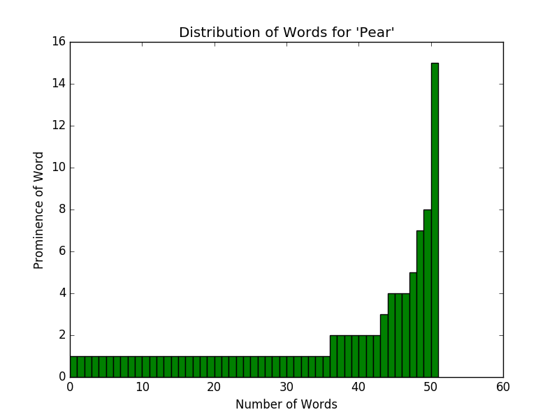

Github: <https://github.com/willythor/LanguageDiffusion>

# A Simple Model for Language Formation and Evolution

## Sungwoo Park, Willem Thorbecke, Ziyu (Selina) Wang
## Team Name: Shoots Den!

### Abstract:
This model investigates the proccess of language formation and evolution through the use of an agent-based model. Each agent in the model starts with no language at all and gradually builds their vocubularies through interaction with other agents. The formation and variation of the vocabularies follows a set of simple rules. We aim to provide an explanatory model that can be used to show the possiblity of reducing the process of language evolution to a set of simple rules.

### Bibliography:

<https://fatiherikli.github.io/language-evolution-simulation/>

This is a link to a javascript implementation of agent-based simulation in language evolution context.Even though this is not an academic paper, the experiment that this simulation is replicating is very relevant to the topic that we are trying to investigate. In this agent-based model, there is a number of agents from three distinct islands with different vocabulary. The experiment simulates the random interactions between those agents and introduces the mutations among the vocabularies. It does not seem like this simulation has a meaningful conclusion or result, so it would be our job to extend this simulation by adding more detailed agent interactions and observing the result to come up with a meaningful conclusion.

**Lekvam, Gamback, Bungum, "Agent-based modeling of Language Evolution"**

<http://www.aclweb.org/anthology/W14-0510>

This paper models the process of language evolution through a simulation model called a language game simulation. In this model, artificial agents interact with each other to reach a cooperative goal: to create a shared language. Based on a certain set of rules, agents attempt a conversation. If both agents can understand the conversation, the conversation becomes a part of the language. If a conversation isn’t successful, the agents attempt to create a new set of words that other agent would be able to understand.

**Berrah, Glotin, Laboissiere, Bessiere, Boe, "From Form to Formation of Phonetic Structures: An evolutionary computing perspective"**

<http://citeseerx.ist.psu.edu/viewdoc/download;jsessionid=237E415FCEE4528600B201AC44CB51A0?doi=10.1.1.54.7332&rep=rep1&type=pdf>

This paper explores the evolution of phonetics using a society of speech robots. One such experiment in this paper used machine learning to create a function that takes as an input vowel sounds and outputs a metric of difficult to expose a more prominent explanation of why certain vowel sounds are so prominent. This experiment used machine learning to parameters including lips, jaw, larynx, and tongue, to correctly model the difficulty of each vowel sound. The paper concluded that a large factor in the popularity of a given syllable was the acoustic efficiency and articulatory cost of said syllable.

**Luc Steels, “The synthetic modeling of language origins”**

<https://www.csl.sony.fr/downloads/papers/1997/web-coe.pdf>

This paper delves into the various aspects of the formation of a language. This includes the fact that language is diffused in a cultural manner instead of in a genetic fashion (memetic). Language evolution is also a product of factors such as communicative success, and a minimization of brain processing. Thus language is often a product of functionality more than anything else. The paper was more or less inconclusive, but stated that the three main areas of research that seem most promising are genetic evolution, cultural adaptation, and genetic assimilation.

**Luc Steels, "A Self Organizing Spatial Vocabulary"**

<https://ai.vub.ac.be/sites/default/files/Steels%20-%201995%20-%20A%20Self-Organizing%20Spatial%20Vocabulary.pdf>

The experiment that this paper is presenting is an agent-based model that simulates the evolution and adaption of a language. In this model, agents are programmed to attempt a conversation with a different agent in the model and communicate the location of other agents. In the very beginning of the simulation, the agents do not have any words in their language. As a model progresses, the agents interact with other agents and develop a set of words that have spatial meanings (ex. left, right, front, etc) to help them communicate with other agents.

###Experiments

The language evolution agent-based model that we are creating is inspired and loosely based on the same experiment from Steels "A Self Organizing Spatial Vocabulary" paper. The Steels paper outlines a set of rules that dictates how new vocabularies are formed and developed. However, we thought that those rules are too restrictive (only words that have spatial meanings are formed) and complicated. We decided to come up with a simple set of rules that we thought more accurately reflects how people acquire new language from scratch. Even though we came up with a custom set of rules, we retained a lot of modeling structures, like how agents interact with each other and have a conversation. In our model, the agents have no vocabularies to start with and there is a predefined list of objects for them to talk about. Their vocabularies are populated in a way that each object they discover is added to their vocabulary as a dictionary mapping from object to a list of words that are used to refer to it. During each time step the agents move to a random neighboring location. The agents have a 50% chance of discovering an object and then coming up with a "word" for it. Then each agent checks to see if there are neighboring agents and picks a random one to have a conversation with about the discovered object or a random object from its current vocabulary if hasn't discovered a new object. If the partner agent doesn't have a "word" for the object, then it adds that the object to its vocabulary and takes the other agent's  "word" for it. If the partner agent already has a word for the object, then they each add the other's "word" for the object to their corresponsing dictionaries. For implementation details of our model, please see Appendix A. We run some carefully selected experiments on this model and the results are quite interesting.

###Question, Methodology, Results, and Intepretation

**Question**: Our biggest question is whether we can simplify a seemingly complex process of language procecss into a set of simple rules that dictate the formation of new vocabulary and the interaction between the agents in the model.

**Methodology**: We are creating an agent-based model with a few simple rules that dictate how new vocabulary is formed and how different agents share their set of vocabularies. In this model, we treat language as a set of object-word mappings. There are three ways an agent acquires a new object-word mapping (learning a new word). First way is the discovery of an object and assigning an arbitrary word for that object. In each step of simulation, there is a small chance that an agent will discover an object that it has not known before and it will generate a new word for that. Second way is learning from other agent. When two agents are adjacent to each other, a coversation happens. During a conversation, two agents will talk about certain object. If one object already has a word for that object but other does not, then the agent that does not know the word learns that word. The third case is when two agents have different word for same object during the conversation. In this case, the agents remembers how other agent refered to the object and adds other agents object-word mapping into its "memory bank". If an agent hears a specific object-word mapping more than what it is current using, it adapts the other object-word mapping, which is more popular.

**Results**:
Our experiment ran with 100 agents for 500 steps produced these words in one of our runs:
[('pear', 'SAD', 15), ('banana', 'GUB', 9), ('orange', 'SAV', 11), ('apple', 'REL', 10)]. 
The number to the right of the word is the prominence of the word among all the agents, e.g., 15 agents use the word 'SAD' for a pear.

Below is a distribution for all the words in use for a pear. 

Format: 

**Interpretations**:
When we ran the experiment we found that the agents converged on two or three prominent words for any given object. The prominence of these words shifted every 100 or so steps, once the simulation had passed its chaotic transient state. An example of this was that the most prominent word for Orange is 'HUR' at step 900 with 8 agents using the word, but then switches to 'KYW' at around step 950, with 9 agents using the word. 
Some words for objects gain so much popularity that they stay the most prominent word indefinitely. An example of this is the word for Apple, 'REK', which had 21 agents using it.
Another thing to note is that many agents use a word for a given object that only they know. This seems like a strange result after 500 steps, but could possibly be rememdied after many thousands of steps. If this proves to be the case even after thousands of steps, the results of our model do not line up with our expectations of the model.

### Learning Goals:
Sung: My learning goal for the second half of the semester is to get a good grasp of the choice of complexity science model that I choose to do my project on. I was hoping to get a new tool and perspective to solve complex problems that I might encounter in the future. By implementing agent-based model to study the process of language evolution and diffusion, I think I can accomplish the aforementioned goals.

Willem: I’d like to learn about the researched and documented theories that describe the diffusion of languages as well as the what simplified rules would allow for a reasonably accurate model of language diffusion. I understand that multiple forms of modeling may help us achieve an accurate representation of language diffusion thus I’d also like to learn more about these tools and how to efficiently utilize them. 

Selina: My learning goal for the final project is to learn more about existing experiments people have done with agent-based models especially in the language evolution and diffusion area. By implementing a model of my own, I will hopefully gain some insights into different ways complex problems are solved by simple solutions/rules. By the end of the project, I am hoping to get a more holistic view on complexity science as a new tool to solve real world problems.
