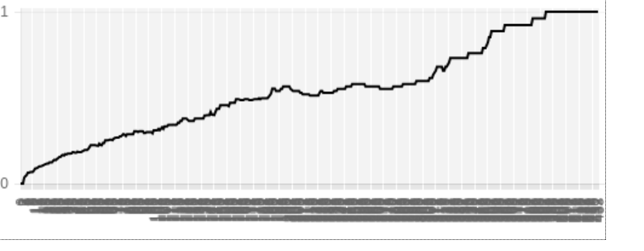

Github: <https://github.com/willythor/LanguageDiffusion>

# A Simple Model for Language Formation
## Sungwoo Park, Willem Thorbecke, Ziyu (Selina) Wang
## Team Name: Shoots Den!

### Abstract:
This model investigates the process of language formation through the use of an agent-based model. Each agent in the model starts with no language at all and gradually builds their vocabularies through interaction with other agents. The formation and variation of the vocabularies follows a set of simple rules. We aim to provide an explanatory model that can be used to show a set of factors that explain the rate and process of language formation.

### Bibliography:

**A Javascript Implementation of Agent-based Simulation in Language Evolution**

<https://fatiherikli.github.io/language-evolution-simulation/>

This is a link to a javascript implementation of an agent-based simulation in language evolution context. Even though this is not an academic paper, the experiment that this simulation is replicating is very relevant to the topic that we are trying to investigate. In this agent-based model, there is a number of agents from three distinct islands with different vocabularies. The experiment simulates the random interactions between those agents and introduces the mutations among the vocabularies. It does not seem like this simulation has a meaningful interpretation or result, so it would be our job to extend this simulation by adding more detailed agent interactions and observing the result to come up with a meaningful conclusion.

**Lekvam, Gamback, Bungum, "Agent-based modeling of Language Evolution"**

<http://www.aclweb.org/anthology/W14-0510>

This paper models the process of language evolution through a simulation model called a language game simulation. In this model, artificial agents interact with each other to reach a cooperative goal: to create a shared language. Based on a certain set of rules, agents attempt a conversation. If both agents can understand the conversation, the conversation becomes a part of the language. If a conversation isn’t successful, the agents attempt to create a new set of words that other agent would be able to understand.

**Berrah, Glotin, Laboissiere, Bessiere, Boe, "From Form to Formation of Phonetic Structures: An evolutionary computing perspective"**

<http://citeseerx.ist.psu.edu/viewdoc/download;jsessionid=237E415FCEE4528600B201AC44CB51A0?doi=10.1.1.54.7332&rep=rep1&type=pdf>

This paper explores the evolution of phonetics using a society of speech robots. One such experiment in this paper used machine learning to create a function that takes as an input vowel sounds and outputs a metric of difficult to expose a more prominent explanation of why certain vowel sounds are so prominent. This experiment used machine learning to parameters including lips, jaw, larynx, and tongue, to correctly model the difficulty of each vowel sound. The paper concluded that a large factor in the popularity of a given syllable was the acoustic efficiency and articulatory cost of said syllable.

**Luc Steels, “The synthetic modeling of language origins”**

<https://www.csl.sony.fr/downloads/papers/1997/web-coe.pdf>

This paper delves into the various aspects of the formation of a language. This includes the fact that language is diffused in a cultural manner instead of in a generic fashion (memetic). Language evolution is also a product of factors such as communicative success, and a minimization of brain processing. Thus language is often a product of functionality more than anything else. The paper was more or less inconclusive, but stated that the three main areas of research that seem most promising are genetic evolution, cultural adaptation, and genetic assimilation.

**Luc Steels, "A Self Organizing Spatial Vocabulary"**

<https://ai.vub.ac.be/sites/default/files/Steels%20-%201995%20-%20A%20Self-Organizing%20Spatial%20Vocabulary.pdf>

The experiment that this paper is presenting is an agent-based model that simulates the evolution and adaption of a language. In this model, agents are programmed to attempt a conversation with a different agent in the model and communicate the location of other agents. In the very beginning of the simulation, the agents do not have any words in their language. As a model progresses, the agents interact with other agents and develop a set of words that have spatial meanings (ex. left, right, front, etc) to help them communicate with other agents.

###Experiments

The language formation agent-based model that we are creating is inspired and loosely based on the similar experiment from Steels "A Self Organizing Spatial Vocabulary" paper. The Steels paper outlines a set of rules that governs the interactions between agents that lead to the formation of shared language. However, we thought that those rules are too restrictive (only words that have spatial meanings are formed) and complicated. We decided to come up with a simpler set of rules that we thought more accurately reflects how people acquire new language from scratch. Even though we came up with a custom set of rules, we retained a lot of modeling structures, like how agents interact with each other and have a conversation. 

In our model, a language is defined as a set of random sequence of three letters that an agent uses to refer to a certain object. Agents have no language to start with and there is a predefined list of objects that they can discover. During the simulation, an agent has an user-defined percentage of chance to discover an object. When an agent discovers an object, it generates a random letter sequence as a “word” for that object and uses that word to refer to that object in future interactions with other agents.

During each time step the agents move to a random neighboring location. Then each agent checks to see if there are neighboring agents and picks a random one to have a conversation with about one of the objects in the model. If both of the agents (initiator and receiver of the conversation) do not have the word for the object, nothing happens. If either of the agents do not have the word, that the agent that does not have the word for the object learns the word from the other agent that knows the word. If both agents have the word for the object and the words are different, each agent adds the word that other agent is using to its “word bank.” The word bank is a collection of all the words that are being used to refer to a certain object that the agent has heard. After the interaction, the word that an agent uses to refer to an word is the word mapping with most frequency in the word bank. Therefore, if an agent has heard a certain word that refers to a specific object more than the current word that the agent uses to refer to the same object, the agent adapts the other word to be its new word for that object.

With this setup, we simulate the process of formation of an unified language under different circumstances. 

###Question, Methodology, Results, and Interpretation

**Question**: 
Does our model result in the formation of an unified language?

**Methodology**: 
We run the model explained above with 50% chance of discovering an object. To quantitatively observe the process of the formation of an unified language, we monitor the [Herfindahl Index](https://en.wikipedia.org/wiki/Herfindahl_index).  For the sake of simplification, there is only one object in this simulation.

**Results**:
For the simulation of 50 agents in the grid of 20 by 20, the Herfindahl index reached 1, meaning everyone uses same word to refer to the object, after 134 steps. 

Below is the graph of change in the Herfindahl index over time.

**Interpretation**:
The result of the simulation produces the result that we expect. Given enough time for the agents to interact with each other, the words that agents use converge into single dominant word. 

**Question**: 
How does different object-discovery odds affect the time it takes to reach word convergence?

**Methodology**:
At each step we defined the chance of an agent discovering a new object. We swept through odds of discovery being 10% all the way up to 100%, incrementing by steps of 10%. For each new chance of discovery we ran 500 trials and took the average as a result.

**Results**:

**Interpretation**:
The higher the odds of discovering a new object, the faster the agents can converge on a single word for a given object. These results can be interpreted as surprising because the higher the odds of discovering a new object, the more words circulating around the grid for that object. More words for a given object should mean slower convergence right? No. If discovery odds are too low then agents take a long time to come up with words for a given object: an agent has to discover an object before it can name it. Thus many interactions between agents result in empty interactions where no words/objects are exchanged, slowing down the rate of convergence.

**Question**:
How does mobility of the agents affect the time it takes to reach word convergence?

**Methodology**:
At each step we specified a the chance of movement for each agent. We swept through the odds of movement being 10% all the way up to 100%, incrementing by steps of 10%. 

**Results**:

**Interpretation**
It takes a long time for a grid of agents to converge on a single word for a given object if the agents have low mobility. The results validate our hypothesis that the higher the mobility, the shorter it takes to reach convergence. With no mobility there is no convergence because each agent can only interact with its neighbors but not people from the other parts of the grid.  When agents have high mobility the rate of diffusion of vocabulary is very quick, because popular words from one area of a grid spread to the rest of the grid faster than when agents have low mobility. This makes sense, because in the real world humans have limited mobility (some more than other), resulting in slow convergence upon a single language, but convergence nonetheless. This is evident during colonization, for example in Hawaii native Hawaiian speakers account for 0.1% of the state population compared to nearly 100% years prior to U.S. occupation. 

### Learning Goals:
Sung: My learning goal for the second half of the semester is to get a good grasp of the choice of complexity science model that I choose to do my project on. I was hoping to get a new tool and perspective to solve complex problems that I might encounter in the future. By implementing agent-based model to study the process of language evolution and diffusion, I think I can accomplish the aforementioned goals.

Willem: I’d like to learn about the researched and documented theories that describe the diffusion of languages as well as what simplified rules would allow for a reasonably accurate model of language diffusion. I understand that multiple forms of modeling may help us achieve an accurate representation of language diffusion thus I’d also like to learn more about these tools and how to efficiently utilize them.  

Selina: My learning goal for the final project is to learn more about existing experiments people have done with agent-based models especially in the language evolution and diffusion area. By implementing a model of my own, I will hopefully gain some insights into different ways complex problems are solved by simple solutions/rules. By the end of the project, I am hoping to get a more holistic view on complexity science as a new tool to solve real world problems.
