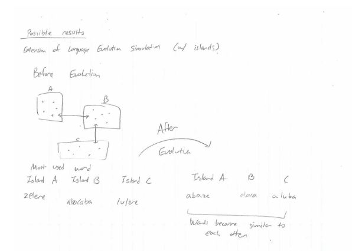

Github: https://github.com/willythor/LanguageDiffusion
A Simple Model for Language Diffusion 
Sungwoo Park, Willem Thorbecke, Ziyu (Selina) Wang

2) An abstract that identifies the topics you intend to investigate and the tools you plan to use.
Abstract: (tools and topics) We plan on modeling the diffusion of multiple languages into either a pidgin or creole language. We plan on using cellular automata as well as evolutionary algorithms used to model the transfer of knowledge via a memetic structure. 

3) An annotated bibliography of 3-5 papers that relate to your topic and/or tools.  Explain what the papers are about, what experiments they report, and what their primary conclusions are.

<https://fatiherikli.github.io/language-evolution-simulation/>
This is a link to a javascript implementation of agent-based simulation in language evolution context. Even though this is not an academic paper, the experiment that this simulation is replicating is very relevant to the topic that we are trying to investigate. In this agent-based model, there is a number of agents from three distinct islands with different vocabulary. The experiment simulates the random interactions between those agents and introduces the mutations among the vocabularies. It does not seem like this simulation has a meaningful conclusion or result, so it would be our job to extend this simulation by adding more detailed agent interactions and observing the result to come up with a meaningful conclusion.

Agent-based modeling of Language Evolution
<http://www.aclweb.org/anthology/W14-0510>
This paper models the process of language evolution through a simulation model called a language game simulation. In this model, artificial agents interact with each other to reach a cooperative goal: to create a shared language. Based on a certain set of rules, agents attempt a conversation. If both agents can understand the conversation, the conversation becomes a part of the language. If a conversation isn’t successful, the agents attempt to create a new set of words that other agent would be able to understand.

Berrah, Glotin, Laboissiere, Bessiere, Boe, “From Form to Formation of Phonetic Structures: An evolutionary computing perspective”

Downloaded from: <http://citeseerx.ist.psu.edu/viewdoc/download;jsessionid=237E415FCEE4528600B201AC44CB51A0?doi=10.1.1.54.7332&rep=rep1&type=pdf 11-3-16>

Review by Willem Thorbecke

This paper explores the evolution of phonetics using a society of speech robots. One such experiment in this paper used machine learning to create a function that takes as an input vowel sounds and outputs a metric of difficult to expose a more prominent explanation of why certain vowel sounds are so prominent. This experiment used machine learning to parameters including lips, jaw, larynx, and tongue, to correctly model the difficulty of each vowel sound. The paper concluded that a large factor in the popularity of a given syllable was the acoustic efficiency and articulatory cost of said syllable.

Luc Steels, “The synthetic modeling of language origins”
Downloaded from: <https://www.csl.sony.fr/downloads/papers/1997/web-coe.pdf 11-3-2016>

Review by Willem Thorbecke

This paper delves into the various aspects of the formation of a language. This includes the fact that language is diffused in a cultural manner instead of in a genetic fashion (memetic). Language evolution is also a product of factors such as communicative success, and a minimization of brain processing. Thus language is often a product of functionality more than anything else. The paper was more or less inconclusive, but stated that the three main areas of research that seem most promising are genetic evolution, cultural adaptation, and genetic assimilation.

4) Present 1-3 experiments from these papers that you plan to replicate and 1-3 extensions or variations of those experiments you are considering.

This figure predicts the probability of a clash between a vowel and consonant based upon the acoustic efficiency and articulatory cost of the clash of each vowel and consonant. This was done through modeling vocal tracts and adjusting it through machine learning.

Above image is a visualization of the language evolution simulation mentioned in part 3 of this document. A black dot represent an agent with a certain set of vocabularies. Agents from different islands have different vocabularies and there is a random chance of interaction among the agents. This simulation has a fairly simple rules for the interactions between the agents (10% chance of random letter mutation, etc). We plan to extend this simulation to reflect more accurate model of language diffusion, by referring to actual linguistic models and studies.

5) Sketch what the results from these experiments might look like, possibly using a cartoon of a graphical result.  Explain how you will interpret the results

Before a language evolution takes place, vocabularies from three different regions are quite different, as shown in the different “most used word.” If the most used word from three regions become similar as a result of the simulation, I think we can conclude that the language evolution has taken place.

6) Learning Goals
Sung: My learning goal for the second half of the semester is to get a good grasp of the choice of complexity science model that I choose to do my project on. I was hoping to get a new tool and perspective to solve complex problems that I might encounter in the future. By implementing agent-based model to study the process of language evolution and diffusion, I think I can accomplish the aforementioned goals.

Willem: I’d like to learn about the researched and documented theories that describe the diffusion of languages as well as the what simplified rules would allow for a reasonably accurate model of language diffusion. I understand that multiple forms of modeling may help us achieve an accurate representation of language diffusion thus I’d also like to learn more about these tools and how to efficiently utilize them. 

Selina: My learning goal for the final project is to learn more about existing experiments people have done with agent-based models especially in the language evolution and diffusion area. By implementing a model of my own, I will hopefully gain some insights into different ways complex problems are solved by simple solutions/rules. By the end of the project, I am hoping to get a more holistic view on complexity science as a new tool to solve real world problems.
